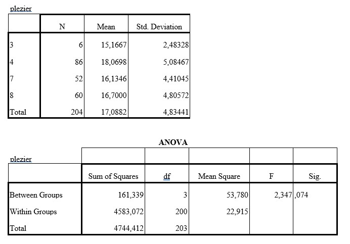

```{r, echo = FALSE, results = "hide"}
include_supplement("uu-Oneway-ANOVA-858-nl-graph01.jpg", recursive = TRUE)
```
Question
========
In een onderzoek naar schoolplezier is aan een steekproef van leerlingen van de groepen 3, 4, 7 en 8 van een aantal basisscholen een vragenlijst voorgelegd met 8 vragen die het schoolplezier meten. Bij alle vragen waren er vier antwoordcategorieën waarbij een hoge score betekende dat de leerling plezier had in het naar school gaan.

Met behulp van variantieanalyse is nagegaan of de groepen verschillen in schoolplezier. Getoetst wordt met $\alpha$ = .05. De SPSS-output tref je hieronder aan.




Wat is de conclusie op basis van deze output?

Answerlist
----------
* De groepen verschillen niet significant in schoolplezier.
* De groepen verschillen niet significant in schoolplezier, maar een post hoc analyse moet uitgevoerd worden om na te gaan welke groepen wellicht wel significant verschillen.
* De groepen verschillen significant in schoolplezier, kinderen uit de groep 4 hebben meer plezier dan de andere groepen.
* De groepen verschillen significant in schoolplezier, een posthoc analyse moet uitwijzen welke groepen significant van elkaar verschillen in schoolplezier.


Solution
========


Meta-information
================
exname: uu-Oneway ANOVA-858-nl
extype: schoice
exsolution: 1000
exsection: Inferential Statistics/Parametric Techniques/ANOVA/Oneway ANOVA
exextra[ID]: 0cdca
exextra[Type]: Interpretating output
exextra[Program]: 
exextra[Language]: Dutch
exextra[Level]: Statistical Literacy