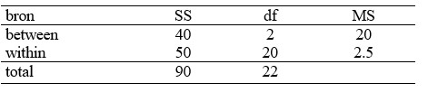

```{r, echo = FALSE, results = "hide"}
include_supplement("uu-Oneway-ANOVA-859-nl-tabel.jpg", recursive = TRUE)
```


Question
========
  
Uit een onderzoek is het resultaat in onderstaande ANOVA-tabel gepresenteerd


  
Hieruit blijkt dat: 

Answerlist
----------
* Het gevonden resultaat is niet significant op 5% want $F_{obt}$ < $F_{crit}$.
* Het gevonden resultaat is niet significant op 5% want $F_{obt}$ > Fcrit
* Het gevonden resultaat is significant op 5% want $F_{obt}$ > $F_{crit}$.
* Het gevonden resultaat is significant op 5% want $F_{obt}$ < $F_{crit}$.


Solution
========
  


Meta-information
================
exname: uu-Oneway ANOVA-859-nl.Rmd
extype: schoice
exsolution: 0010
exsection: Inferential Statistics/Parametric Techniques/ANOVA/Oneway ANOVA
exextra[ID]: 41233
exextra[Type]: Interpretating output
exextra[Program]: SPSS
exextra[Language]: Dutch
exextra[Level]: Statistical Literacy
