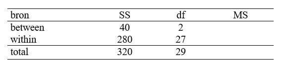

```{r, echo = FALSE, results = "hide"}
include_supplement("uu-Oneway-ANOVA-860-nl-graph01.jpg", recursive = TRUE)
```
Question
========
Een onderzoekster veronderstelt dat 12-jarigen enkelvoudige (single) taken beter kunnen uitvoeren dan meervoudige (multiple) taken. Voor dit experiment werden 30 kinderen gelijk en at random verdeeld over de twee condities.
In de single conditie moesten ze fouten in een tekst aanstrepen. In de multiple conditie werd hetzelfde gevraagd, maar werd daarbij regelmatig onaangekondigd een korte andere opdracht gegeven.
Getoetst wordt op 5% niveau.
Onderstaande ANOVA-tabel geeft de resultaten van dit experiment:




Hieruit blijkt dat:

Answerlist
----------
* De onderzoekshypothese moet niet worden aanvaard, want $F_{obt}$ < $F_{crit}$.
* De onderzoekshypothese moet niet worden aanvaard, want $F_{obt}$ > $F_{crit}$.
* De onderzoekshypothese moet worden aanvaard, want $F_{obt}$ > $F_{crit}$.
* De onderzoekshypothese moet worden aanvaard, want $F_{obt}$ < $F_{crit}$.


Solution
========


Meta-information
================
exname: uu-Oneway ANOVA-860-nl
extype: schoice
exsolution: 0010
exsection: Inferential Statistics/Parametric Techniques/ANOVA/Oneway ANOVA
exextra[ID]: 035e2
exextra[Type]: Interpretating output, Calculation
exextra[Program]: 
exextra[Language]: Dutch
exextra[Level]: Statistical Literacy