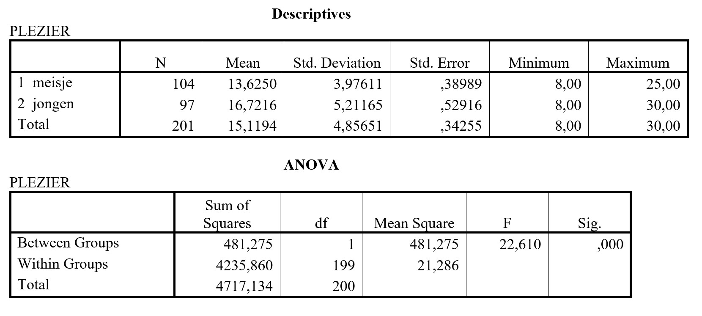

```{r, echo = FALSE, results = "hide"}
include_supplement("uu-Oneway-ANOVA-861-nl-graph01.jpg", recursive = TRUE)
```
Question
========
In a study on school enjoyment, grade 7 students from a number of elementary schools were asked a questionnaire with eight questions measuring school enjoyment (or lack thereof). For all questions there were four response categories where a high score meant that the student enjoyed going to school. An analysis of variance was used to determine whether boys and girls differ in school enjoyment. It was tested with $\alpha$ = 5%. The SPSS output is shown below.




What is the conclusion based on this output?

Answerlist
----------
* Boys and girls differ significantly in school fun; a post hoc analysis should reveal whether boys or girls have more fun
* Boys and girls differ significantly in school fun; boys have more fun than girls
* Boys and girls do not differ in school fun; therefore, a post hoc analysis must be conducted
* The question of whether boys and girls differ in school fun can only be answered with an Independent samples T-test, not with analysis of variance.


Solution
========

Meta-information
================
exname: uu-Oneway ANOVA-861-en
extype: schoice
exsolution: 0100
exsection: Inferential Statistics/Parametric Techniques/ANOVA/Oneway ANOVA
exextra[ID]: 8efbd
exextra[Type]: Interpretating output
exextra[Program]: 
exextra[Language]: English
exextra[Level]: Interpretating output