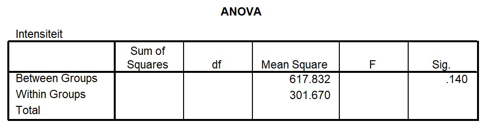

```{r, echo = FALSE, results = "hide"}
include_supplement("uu-Oneway-ANOVA-865-nl-graph01.jpg", recursive = TRUE)
```
```{r, echo = FALSE, results = "hide"}
include_supplement("uu-Oneway-ANOVA-865-nl-graph02.jpg", recursive = TRUE)
```
Question
========
The 20-item "Parenting Hassles Scale" asks parents of young children to rate certain, common situations for (1) how often it occurs (frequency); and (2) how much it bothers them (intensity). The scoring system for the frequency rating is 0-4 points (0 = never, 4 = consistently) and for the intensity rating is 1-5 points (1 = very little, 5 very much). If a 0 (zero) is obtained for a frequency item, that item also becomes 0 (zero) for the intensity. The total scores for these two assessments form the frequency scale (0-80) and the intensity scale (0-100). 


Intensity scale scores are compared between mothers (including adoptive mothers), fathers (including adoptive fathers) and foster parents. The descriptive statistics are shown in Table 1. We see that mothers generally score lowest (M = 50.95) and foster parents score highest (M = 62.41). Part of the SPSS output for the comparison of the three groups is below.



The researchers want to adjust the differences between the three types of parents for any differences on the frequency scale. One of the conditions for doing this is "linearity." The relationship between which variables must be linear?

Answerlist
----------
* The relationship between frequency scale scores and type of parent by intensity value (0-4)
* The relationship between intensity scale scores and frequency scale scores by type of parent
* The relationship between type of parent and intensity scale scores by frequency value (1-5)
* The relationship between foster parents and frequency scale scores and the relationship between non-foster parents and intensity scale scores


Solution
========

Meta-information
================
exname: uu-Oneway ANOVA-865-en
extype: schoice
exsolution: 0100
exsection: Inferential Statistics/Parametric Techniques/ANOVA/Oneway ANOVA
exextra[Type]: Interpretating output, Calculation
exextra[Program]: 
exextra[Language]: English
exextra[Level]: Statistical Reasoning