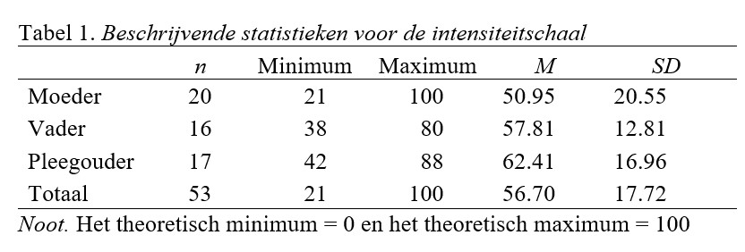

```{r, echo = FALSE, results = "hide"}
include_supplement("uu-Oneway-ANOVA-865-nl-graph01.jpg", recursive = TRUE)
```
```{r, echo = FALSE, results = "hide"}
include_supplement("uu-Oneway-ANOVA-865-nl-graph02.jpg", recursive = TRUE)
```
Question
========
In de 20-item “Parenting Hassles Scale” worden ouders van jonge kinderen gevraagd om bepaalde, veel voorkomende situaties te beoordelen op (1) hoe vaak het voorkomt (frequentie); en (2) hoeveel last ze er van ervaren (intensiteit). Het score systeem voor de frequentie beoordeling is 0-4 punten (0 = nooit, 4 = constant) en voor de intensiteit beoordeling is 1-5 punten (1 = heel weinig, 5 heel veel). Als er voor een frequentie-item een 0 (nul) wordt gehaald, wordt dat item ook 0 (nul) voor de intensiteit. De totaalscores voor deze twee beoordelingen vormen de frequentieschaal (0-80) en de intensiteitschaal (0-100). 



De scores op de intensiteitschaal worden vergeleken tussen moeders (inclusief adoptiemoeders), vaders (inclusief adoptievaders) en pleegouders. De beschrijvende statistieken staan in tabel 1. We zien dat moeders over het algemeen het laagst scoren (M = 50.95) en pleegouders het hoogst (M = 62.41). Deel van de SPSS output voor de vergelijking van de drie groepen staat hieronder.


De onderzoekers willen de verschillen tussen de drie typen ouders aanpassen aan eventuele verschillen op de frequentieschaal. Een van de voorwaarden om dit te kunnen doen is “lineariteit”. Het verband tussen welke variabelen moet lineair zijn?

Answerlist
----------
* Het verband tussen frequentie schaalscores en type ouder per intensiteitwaarde (0-4)
* Het verband tussen intensiteit schaalscores en frequentie schaalscores per type ouder
* Het verband tussen type ouder en intensiteit schaalscores per frequentiewaarde (1-5)
* Het verband tussen pleegouders en frequentie schaalscores en het verband tussen niet-pleegouders en intensiteit schaalscores


Solution
========


Meta-information
================
exname: uu-Oneway ANOVA-865-nl
extype: schoice
exsolution: 0100
exsection: Inferential Statistics/Parametric Techniques/ANOVA/Oneway ANOVA
exextra[ID]: b01e1
exextra[Type]: Interpretating output, Calculation
exextra[Program]: 
exextra[Language]: Dutch
exextra[Level]: Statistical Reasoning