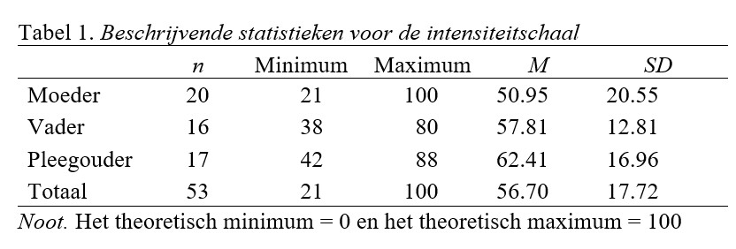
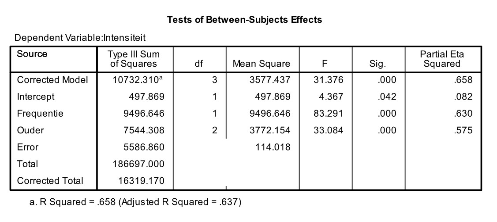

```{r, echo = FALSE, results = "hide"}
include_supplement("uu-Oneway-ANOVA-866-nl-graph01.jpg", recursive = TRUE)
```
```{r, echo = FALSE, results = "hide"}
include_supplement("uu-Oneway-ANOVA-866-nl-graph02.jpg", recursive = TRUE)
```
```{r, echo = FALSE, results = "hide"}
include_supplement("uu-Oneway-ANOVA-866-nl-graph03.jpg", recursive = TRUE)
```
Question
========
The 20-item "Parenting Hassles Scale" asks parents of young children to rate certain, common situations for (1) how often it occurs (frequency); and (2) how much it bothers them (intensity). The scoring system for the frequency rating is 0-4 points (0 = never, 4 = consistently) and for the intensity rating is 1-5 points (1 = very little, 5 very much). If a 0 (zero) is obtained for a frequency item, that item also becomes 0 (zero) for the intensity. The total scores for these two assessments form the frequency scale (0-80) and the intensity scale (0-100). 



Intensity scale scores are compared between mothers (including adoptive mothers), fathers (including adoptive fathers) and foster parents. Descriptive statistics are shown in Table 1. We see that mothers generally score lowest (M = 50.95) and foster parents score highest (M = 62.41). Part of the SPSS output for the comparison of the three groups is below.


The researchers want to know if adjusting for any differences on the frequency scale changes the results of the ANOVA conducted for this purpose. Below is the SPSS output of this analysis. 



Do the adjusted mean intensity scale scores now differ significantly? What is the test size you use to answer this question?

Answerlist
----------
* Yes, the adjusted differences are significant, F = 33.084
* Yes, the adjusted differences are significant, F = 83.291
* No, the adjusted differences are not significant, F = 33.084
* No, the adjusted differences are not significant, F = 83.291


Solution
========

Meta-information
================
exname: uu-Oneway ANOVA-866-en
extype: schoice
exsolution: 1000
exsection: Inferential Statistics/Parametric Techniques/ANOVA/Oneway ANOVA
exextra[Type]: Interpretating output, Calculation
exextra[Program]: SPSS
exextra[Language]: English
exextra[Level]: Statistical Reasoning