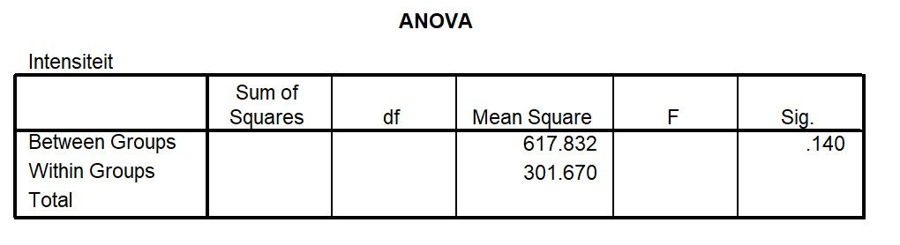

```{r, echo = FALSE, results = "hide"}
include_supplement("uu-Oneway-ANOVA-866-nl-graph01.jpg", recursive = TRUE)
```
```{r, echo = FALSE, results = "hide"}
include_supplement("uu-Oneway-ANOVA-866-nl-graph02.jpg", recursive = TRUE)
```
```{r, echo = FALSE, results = "hide"}
include_supplement("uu-Oneway-ANOVA-866-nl-graph03.jpg", recursive = TRUE)
```
Question
========
In de 20-item “Parenting Hassles Scale” worden ouders van jonge kinderen gevraagd om bepaalde, veel voorkomende situaties te beoordelen op (1) hoe vaak het voorkomt (frequentie); en (2) hoeveel last ze er van ervaren (intensiteit). Het score systeem voor de frequentie beoordeling is 0-4 punten (0 = nooit, 4 = constant) en voor de intensiteit beoordeling is 1-5 punten (1 = heel weinig, 5 heel veel). Als er voor een frequentie-item een 0 (nul) wordt gehaald, wordt dat item ook 0 (nul) voor de intensiteit. De totaalscores voor deze twee beoordelingen vormen de frequentieschaal (0-80) en de intensiteitschaal (0-100). 


De scores op de intensiteitschaal worden vergeleken tussen moeders (inclusief adoptiemoeders), vaders (inclusief adoptievaders) en pleegouders. De beschrijvende statistieken staan in tabel 1. We zien dat moeders over het algemeen het laagst scoren (M = 50.95) en pleegouders het hoogst (M = 62.41). Deel van de SPSS output voor de vergelijking van de drie groepen staat hieronder.



De onderzoekers willen weten of de aanpassing aan eventuele verschillen op de frequentieschaal de resultaten van de hiervoor uitgevoerde ANOVA veranderen. Hieronder staat de SPSS output van deze analyse. 


Verschillen de aangepaste gemiddelde intensiteit schaalscores nu significant? Wat is de toetsingsgrootheid die je gebruikt om deze vraag te beantwoorden?

Answerlist
----------
* Ja, de aangepaste verschillen zijn significant, F = 33.084
* Ja, de aangepaste verschillen zijn significant, F = 83.291
* Nee, de aangepaste verschillen zijn niet significant, F = 33.084
* Nee, de aangepaste verschillen zijn niet significant, F = 83.291


Solution
========


Meta-information
================
exname: uu-Oneway ANOVA-866-nl
extype: schoice
exsolution: 1000
exsection: Inferential Statistics/Parametric Techniques/ANOVA/Oneway ANOVA
exextra[ID]: 65e8c
exextra[Type]: Interpretating output, Calculation
exextra[Program]: SPSS
exextra[Language]: Dutch
exextra[Level]: Statistical Reasoning