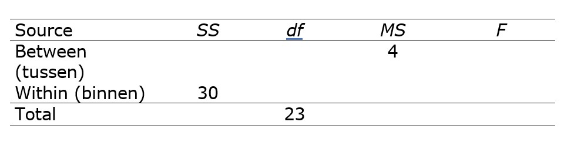
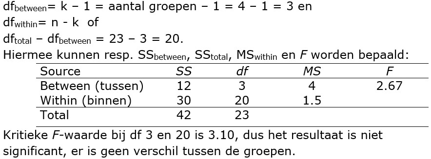

```{r, echo = FALSE, results = "hide"}
include_supplement("uu-Oneway-ANOVA-869-nl-graph01.jpg", recursive = TRUE)
```
```{r, echo = FALSE, results = "hide"}
include_supplement("uu-Oneway-ANOVA-869-nl-graph02.jpg", recursive = TRUE)
```
Question
========
A study examined the effect of doing strength sports on antisocial behavior, among other things. Four groups were identified that differed in the number of months they had done strength sports prior to the study. Presented below is part of the results in an analysis of variance (ANOVA) table. 



What is the result of this test (at  $\alpha$ = .05)?

Answerlist
----------
* There are significant differences in antisocial behavior between the four groups because $F_{obs}$ > $F_{critical}$.
* There are significant differences in antisocial behavior between the four groups because $F_{obs}$ < $F_{critical}$.
* There are no significant differences in antisocial behavior between the four groups because $F_{obs}$ > $F_{critical}$.
* There are no significant differences in antisocial behavior between the four groups because $F_{obs}$ < $F_{kritiek}$


Solution
========


Meta-information
================
exname: uu-Oneway ANOVA-869-en
extype: schoice
exsolution: 0001
exsection: Inferential Statistics/Parametric Techniques/ANOVA/Oneway ANOVA
exextra[Type]: Interpretating output, calculation
exextra[Program]: 
exextra[Language]: English
exextra[Level]: Statistical Reasoning