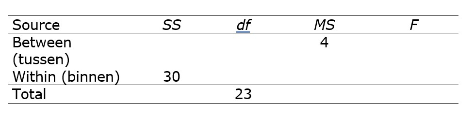
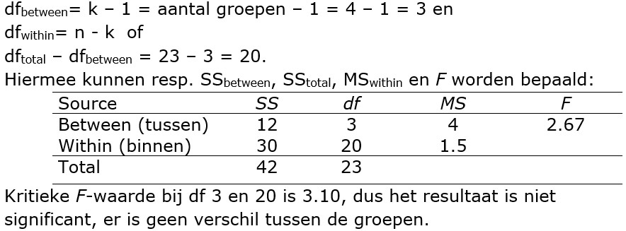

```{r, echo = FALSE, results = "hide"}
include_supplement("uu-Oneway-ANOVA-869-nl-graph01.jpg", recursive = TRUE)
```
```{r, echo = FALSE, results = "hide"}
include_supplement("uu-Oneway-ANOVA-869-nl-graph02.jpg", recursive = TRUE)
```
Question
========
In een onderzoek is nagegaan wat het effect is van het doen van krachtsport op o.a. antisociaal gedrag. Er werden vier groepen onderscheiden die verschilden in het aantal maanden waarin ze krachtsport gedaan hadden voorafgaand aan het onderzoek. Hieronder vind je een deel van de resultaten in een variantie-analyse (ANOVA) tabel gepresenteerd. 



Wat is het resultaat van deze toets (bij  $\alpha$ = .05)?

Answerlist
----------
* Er zijn significante verschillen in antisociaal gedrag tussen de vier groepen omdat $F_{obs}$ > $F_{kritiek}$
* Er zijn significante verschillen in antisociaal gedrag tussen de vier groepen omdat $F_{obs}$ < $F_{kritiek}$
* Er zijn geen significante verschillen in antisociaal gedrag tussen de vier groepen omdat $F_{obs}$ > $F_{kritiek}$
* Er zijn geen significante verschillen in antisociaal gedrag tussen de vier groepen omdat $F_{obs}$ < $F_{kritiek}$


Solution
========



Meta-information
================
exname: uu-Oneway ANOVA-869-nl
extype: schoice
exsolution: 0001
exsection: Inferential Statistics/Parametric Techniques/ANOVA/Oneway ANOVA
exextra[Type]: Interpretating output, calculation
exextra[Program]: 
exextra[Language]: Dutch
exextra[Level]: Statistical Reasoning