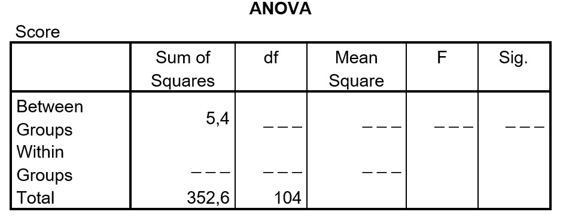

```{r, echo = FALSE, results = "hide"}
include_supplement("uu-Oneway-ANOVA-871-nl-graph01.jpg", recursive = TRUE)
```
Question
========
Below is an incomplete ANOVA table for comparing the mean scores of three groups. What do we know about the F-ratio?



What is the conclusion in the study when tested with $\alpha$ = 5%?

Answerlist
----------
* F = 0.5 and is significant at $\alpha$ = .05
* F = 0.5 and is not significant at $\alpha$ = .05
* F = 0.8 and is significant at $\alpha$ = .05
* F = 0.8 and is not significant at $\alpha$ = .05


Solution
========
When completing the table, calculate:

$SS_{within}$ = $SS_{total}$-$SS_{between}$ = 352.6-5.4= 347.2 $df_{between}$ = k-1= 3-1=2 $df_{within}$ = $df_{total}$ - $df_{between}$ = 104-2= 102 $MS_{between}$ = $$frac{SS_{between}}{df_{between}}$ = $$frac{5.4}{2}$ = 2.7 $MS_{within}}$ = $$frac{SS_{within}}{df_{within}}$ = $$frac{347.2}{102}$ = 3.404$ F=$$frac{MS_{between}}{MS_{within}}$ = $$frac{2.7}{3.404}$ = 0.79 The critical F value is at $df_{between}$ = 2 and $df_{within}$ =102 and $alpha$ = 0.05: 3.09.
Dus F = 0.8 is kleiner dan $F_{krit}$ = 3.09 and thus not significant

Meta-information
================
exname: uu-Oneway ANOVA-871-en
extype: schoice
exsolution: 0001
exsection: Inferential Statistics/Parametric Techniques/ANOVA/Oneway ANOVA
exextra[ID]: 2cdaf
exextra[Type]: Interpretating output, calculation
exextra[Program]: 
exextra[Language]: English
exextra[Level]: Statistical Reasoning