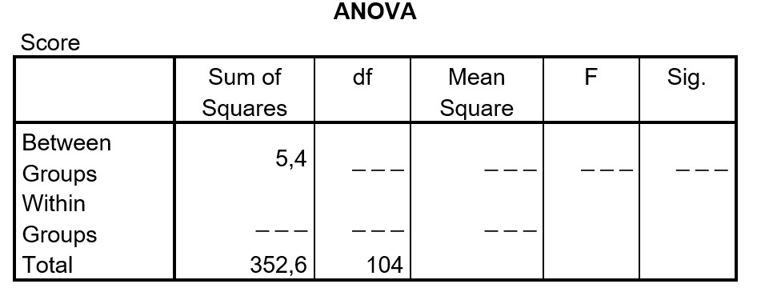

```{r, echo = FALSE, results = "hide"}
include_supplement("uu-Oneway-ANOVA-871-nl-graph01.jpg", recursive = TRUE)
```
Question
========
Hieronder staat een incomplete ANOVA-tabel voor het vergelijken van de gemiddelde scores van drie groepen. Wat weten we van de F-ratio?



Wat is de conclusie in het onderzoek als getoetst wordt met $\alpha$ = 5%?

Answerlist
----------
* F = 0.5 en is significant bij $\alpha$ = .05
* F = 0.5 en is niet significant bij $\alpha$ = .05
* F = 0.8 en is significant bij $\alpha$ = .05
* F = 0.8 en is niet significant bij $\alpha$ = .05


Solution
========
Bij het invullen van de tabel bereken je:

$SS_{within}$ = $SS_{total}$-$SS_{between}$ = 352.6-5.4= 347.2
$df_{between}$ = k-1= 3-1=2
$df_{within}$ = $df_{total}$ - $df_{between}$ = 104-2= 102
$MS_{between}$ = $\frac{SS_{between}}{df_{between}}$ = $\frac{5.4}{2}$ = 2.7
$MS_{within}$ = $\frac{SS_{within}}{df_{within}}$ = $\frac{347.2}{102}$ = 3.404$
F=$\frac{MS_{between}}{MS_{within}}$ = $\frac{2.7}{3.404}$ = 0.79
De kritieke F-waarde is bij $df_{between}$ = 2 en $df_{within}$ =102 en $\alpha$ = 0.05: 3.09.
Dus F = 0.8 is kleiner dan $F_{krit}$ = 3.09 en dus niet significant


Meta-information
================
exname: uu-Oneway ANOVA-871-nl
extype: schoice
exsolution: 0001
exsection: Inferential Statistics/Parametric Techniques/ANOVA/Oneway ANOVA
exextra[Type]: Interpretating output, calculation
exextra[Program]: 
exextra[Language]: Dutch
exextra[Level]: Statistical Reasoning