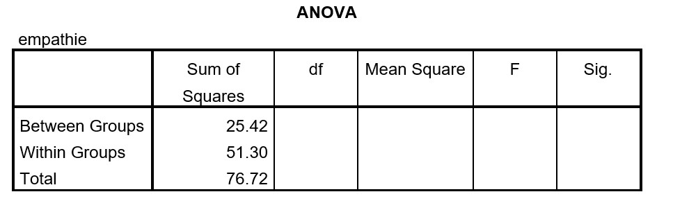

```{r, echo = FALSE, results = "hide"}
include_supplement("uu-Oneway-ANOVA-872-nl-graph01.jpg", recursive = TRUE)
```
Question
========
SPSS is used to analyze data from an experiment with children. Four groups, each of 15 children, are each shown a different video about a child. In group A) the child is being bullied, B) the child falls and runs away crying, C) the child falls and is comforted by a teacher, and D) the child plays. Afterwards, the degree of empathy is measured in all children. Do the videos have a different effect on the average empathy scores? Some of the output is below.



Are the differences between the four groups significant?

Answerlist
----------
* Yes, because F = 9.25 > $F_{kritiek}$
* Yes, because F = 0.50 > $F_{kritiek}$
* No, because F = 0.50 < $F_{kritiek}$
* No, because F = 9.25 < $F_{kritiek}$


Solution
========
$\textit{k}(aantal groepen)$ = 4, so $\textit{df}_{between}$ = 4 -1 = 3
$\textit{N}$ = 4 ${times$ 15 = 60, so ${textit{df}_{total}$ = 60 - 1 = 59 ${df}_{within}$ = $\textit{N}$ - $\textit{k}$ = 60 - 4 = 56

$\begin{equation*}MS_{between} = \frac{SS_{between}}{df_{between}} = \frac{25.42}{3} = 8.473 \end{equation*}$
 
$\begin{equation*} MS_{within} = \frac{SS_{within}}{df_{within}} = \frac{51.30}{56} = 0.916 \end{equation*}$
 
$\begin{equation*} F = \frac{MS_{between}}{MS_{within}} = \frac{8.473}{0.916} = 9.25 \end{equation*}$
  
$\textit{F}$ > $\textit{F}_{kritiek}$(2.78, Table B4, $\alpha$ = 5%) so the groups differ from each other.

Meta-information
================
exname: uu-Oneway ANOVA-872-en
extype: schoice
exsolution: 1000
exsection: Inferential Statistics/Parametric Techniques/ANOVA/Oneway ANOVA
exextra[ID]: a2c16
exextra[Type]: Interpretating output, Calculation
exextra[Program]: 
exextra[Language]: English
exextra[Level]: Statistical Reasoning