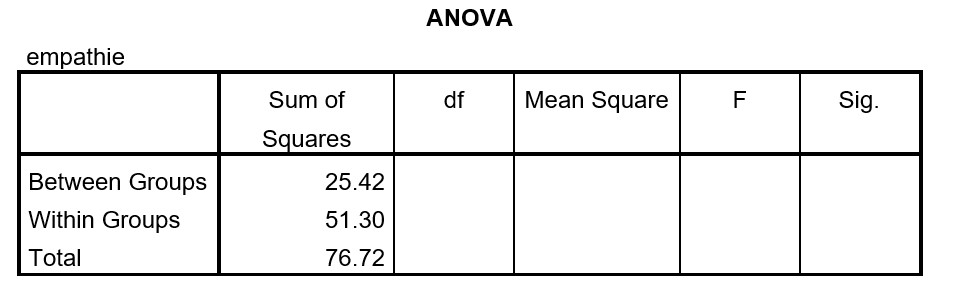
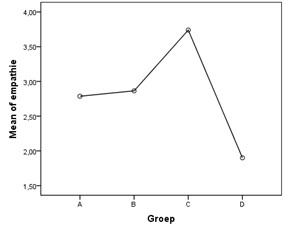

```{r, echo = FALSE, results = "hide"}
include_supplement("uu-Oneway-ANOVA-874-nl-graph01.jpg", recursive = TRUE)
```

```{r, echo = FALSE, results = "hide"}
include_supplement("uu-Oneway-ANOVA-874-nl-graph02.jpg", recursive = TRUE)
```

Question
========
SPSS is used to analyze data from an experiment with children. Four groups, each or 15 children, are each shown a different video about a child. In group A) the child is being bullied, B) the child falls and runs away crying, C) the child falls and is comforted by a teacher, and D) the child plays. Afterwards, the degree or empathy is measured in all children. Do the movies have a different effect on the average empathy scores? Some or the output is below.



The following mean chart is part or the SPSS output. 



The difference between groups A (bullying) and B (falling and running away crying) does not appear to be significant. Thus, if the researcher were to combine these groups together, you get three groups: (1) a combination or A and B, (2) group C and (3) group D). In this situation, what would be the degrees or freedom associated with the F-Ratio?

Answerlist
----------
* 3 and 41
* 3 and 56
* 2 and 42
* 2 and 57


Solution
========
If two groups go together there are:
$\textit{df}_{between} = \textit{k} - 1 = 3 - 1 = \textbf{2}$
$\textit{df}_{within} = \textit{N} - \textit{k} = 60 - 3 = \textbf{57}$

$\textbf{Foutieve antwoorden}$
When you go for $\textbf{3}$ have chosen as $\textit{df}_{between}$ you have not taken into account that the researcher is combining two groups together. As a result, the number or groups ($\textit{k}$) 3 instead or 4 When you $\textbf{42}$ or $\textbf{41}$ have opted for $\textit{df}_{within}$ you have assumed that all three groups used by the researcher still consist of 15 participants. For $\textit{N}$ would then hold: 3 x 15 = 45.However, this is incorrect. The number of participants changes $\underline{niet}$s when merging groups.

Meta-information
================
exname: uu-Oneway ANOVA-874-en
extype: schoice
exsolution: 0001
exsection: Inferential Statistics/Parametric Techniques/ANOVA/Oneway ANOVA
exextra[ID]: f45c0
exextra[Type]: Interpretating graph, calculation
exextra[Program]: SPSS
exextra[Language]: English
exextra[Level]: Statistical Reasoning