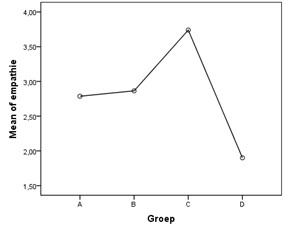

```{r, echo = FALSE, results = "hide"}
include_supplement("uu-Oneway-ANOVA-874-nl-graph01.jpg", recursive = TRUE)
```

```{r, echo = FALSE, results = "hide"}
include_supplement("uu-Oneway-ANOVA-874-nl-graph02.jpg", recursive = TRUE)
```

Question
========
SPSS wordt gebruikt om data te analyseren van een experiment met kinderen. Vier groepen, ieder van 15 kinderen, krijgen elk een ander filmpje over een kind te zien. In groep A) wordt het kind gepest, B) valt het kind en loopt huilend weg, C) valt het kind en wordt het door een leerkracht getroost, en D) speelt het kind. Na afloop wordt de mate van empathie gemeten bij alle kinderen. Hebben de filmpjes een verschillend effect op de gemiddelde empathiescores? Een deel van de output staat hieronder.


Het volgende gemiddeldendiagram maakt deel uit van de SPSS output. 



Het verschil tussen groepen A (pesten) en B (vallen en huilend weglopen) blijkt niet significant te zijn. Als de onderzoeker deze groepen bij elkaar zou voegen, krijg je dus drie groepen: (1) een combinatie van A en B, (2) groep C en (3) groep D). Wat zouden in deze situatie de vrijheidsgraden zijn die bij de F-ratio horen?

Answerlist
----------
* 3 en 41
* 3 en 56
* 2 en 42
* 2 en 57


Solution
========
Indien er twee groepen samen gaan zijn er:
$\textit{df}_{between} = \textit{k} - 1 = 3 - 1 = \textbf{2}$
$\textit{df}_{within} = \textit{N} - \textit{k} = 60 - 3 = \textbf{57}$

$\textbf{Foutieve antwoorden}$
Wanneer je voor $\textbf{3}$ hebt gekozen als $\textit{df}_{between}$ heb je er geen rekening mee gehouden dat de onderzoeker twee groepen samenvoegt. Daardoor is het aantal groepen ($\textit{k}$) 3 i.p.v. 4
 Wanneer je $\textbf{42}$ of $\textbf{41}$ hebt gekozen voor $\textit{df}_{within}$ ben je er van uit gegaan dat alle drie de groepen die de onderzoeker gebruikt nog uit 15 participanten bestaat. Voor $\textit{N}$ zou dan gelden: 3 x 15 = 45.Dit is echter onjuist. Het aantal participanten verandert $\underline{niet}$s bij het samenvoegen van groepen.


Meta-information
================
exname: uu-Oneway ANOVA-874-nl
extype: schoice
exsolution: 0001
exsection: Inferential Statistics/Parametric Techniques/ANOVA/Oneway ANOVA
exextra[ID]: 0e903
exextra[Type]: Interpretating graph, calculation
exextra[Program]: SPSS
exextra[Language]: Dutch
exextra[Level]: Statistical Reasoning