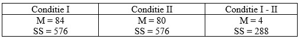

```{r, echo = FALSE, results = "hide"}
include_supplement("uu-Paired-samples-601-nl-tabel.jpg", recursive = TRUE)
```

Question
========
  
An oil company claims that it has a gasoline additive that makes cars drive more economically. To prove this, it has a sample of 9 cars drive the same 1000 kilometer route twice; once without additive (Condition I) and once with additive (Condition II). The average gasoline consumption (in liters) and the corresponding squared sums are given in the table below. Based on a one-way test with $\alpha=.05$ conclude that cars with the addition drive more economically?



  
Answerlist
----------

* Yes, because $s_{M_D} = 0.67$ gives a $t$-value of $6.00$. 
* Ja, want $s_{M_D} = 0.63$ gives a $t$-value of $6.36$.  
* Nee, want $s_{(M_1-M_2)} = 3.99$ gives a $t$-value of $1.00$.
* Nee, want $s_{(M_1-M_2)} = 3.77$ gives a $t$-value of $1.06$. 

Solution
========

Answerlist
----------

* Correct
* Not correct
* Not correct
* Not correct

Meta-information
================
exname: uu-Paired-samples-601-en
extype: schoice
exsolution: 1000
exsection: Inferential Statistics/Parametric Techniques/t-test/Paired samples
exextra[Type]: Case
exextra[Language]: English
exextra[Level]: Statistical Literacy
