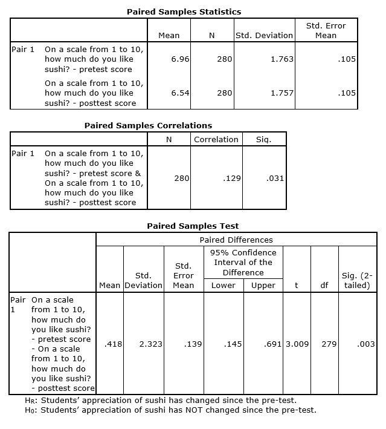

```{r, echo = FALSE, results = "hide"}
include_supplement("uu-Paired-samples-801-en-tabel.jpg", recursive = TRUE)
```


Question
========
  
As part of a customer satisfaction survey, the managers of a university dining hall asked 280 students how much they liked different types of food (pre-test). They found that sushi was the most positively evaluated type of food. Based on this survey, the managers decided to offer sushi as part of the lunch menu. Three months later, they re-contacted the respondents who took part in the first survey and asked them again how much they liked sushi (post-test). The dining hall managers wanted to know if students’ appreciation of sushi had changed since the first survey.

They found the following results:



  
Answerlist
----------
* M = 0, S = .139
* M = .418, S = 1.763
* M = 6.96, S = .105
* M = 0, S = 2.323


Solution
========
  


Answerlist
----------


Meta-information
================
exname: uu-Paired-samples-801-en.Rmd
extype: schoice
exsolution: 1000
exsection: Inferential Statistics/Parametric Techniques/t-test/Paired samples
exextra[Type]: Interpretating output
exextra[Language]: English
exextra[Level]: Statistical Literacy
