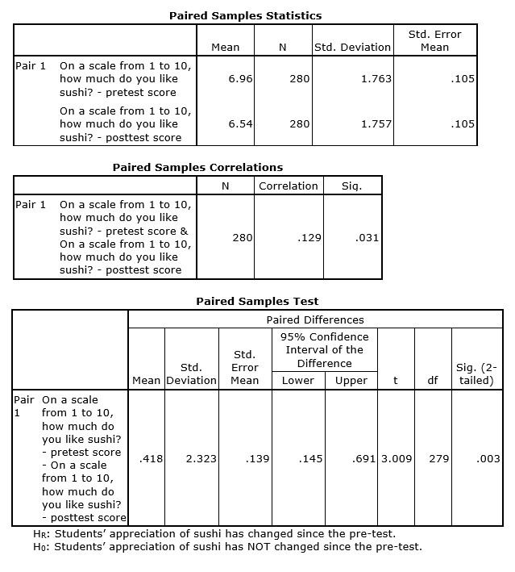

```{r, echo = FALSE, results = "hide"}
include_supplement("uu-Paired-samples-801-en-tabel.jpg", recursive = TRUE)
```

Question
========
  
Als onderdeel van een klanttevredenheidsonderzoek vroegen de managers van een eetzaal aan 280 studenten hoe lekker ze verschillende soorten eten vonden (pre-test). Ze ontdekten dat sushi het meest positief werd beoordeeld. Op basis van deze enquête besloten de managers sushi aan te bieden als onderdeel van het lunchmenu. Drie maanden later namen ze opnieuw contact op met de respondenten die deelnamen aan de eerste enquête en vroegen ze opnieuw hoe lekker ze sushi vonden (post-test). De managers van de eetzaal wilden weten of de waardering van studenten voor sushi was veranderd sinds de eerste enquête.

Ze vonden de volgende resultaten:



  
Answerlist
----------
* M = 0, S = .139
* M = .418, S = 1.763
* M = 6,96, S = .105
* M = 0, S = 2,323


Solution
========

Meta-information
================
exname: uu-Paired-samples-801-nl
extype: schoice
exsolution: 1000
exsection: Inferential Statistics/Parametric Techniques/t-test/Paired samples
exextra[Type]: Interpretating output
exextra[Language]: Dutch
exextra[Level]: Statistical Literacy
