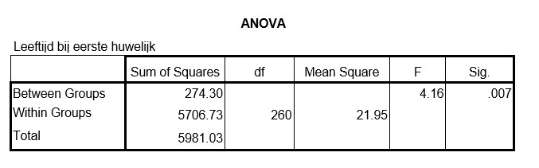
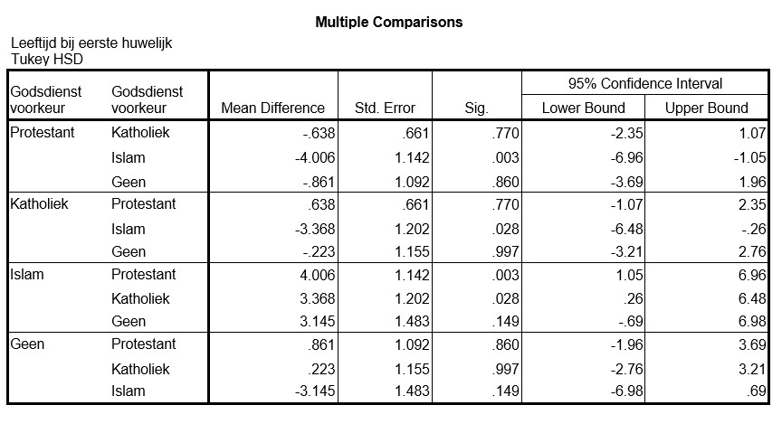

```{r, echo = FALSE, results = "hide"}
include_supplement("uu-Post-hoc-test-802-nl-graph01.jpg", recursive = TRUE)
include_supplement("uu-Post-hoc-test-802-nl-graph02.jpg", recursive = TRUE)
```
Question
========


Met een p-waarde van 0.007 kunnen we de conclusie trekken dat er significante verschillen zijn tussen de groepen met verschillende godsdienst. SPSS wordt gebruikt om een post-hoc toets te doen. De output staat hieronder.



Welke godsdienst zorgt ervoor dat we $H_{0}$ verwerpen?

Answerlist
----------
* Islam
* Katholiek
* Protestant
* Geen


Solution
========


Meta-information
================
exname: uu-Post-hoc test-802-nl
extype: schoice
exsolution: 1000
exsection: Inferential Statistics/Parametric Techniques/ANOVA/Post-hoc test
exextra[Type]: Interpretating output
exextra[Program]: SPSS
exextra[Language]: Dutch
exextra[Level]: Statistical Reasoning