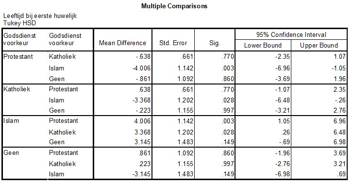

```{r, echo = FALSE, results = "hide"}
include_supplement("uu-Post-hoc-test-801-nl-tabel.jpg", recursive = TRUE)
```

Question
========
Based on ANOVA analysis, it is concluded that there are significant differences between religious groups in the age of a respondent at his or her first marriage. SPSS is used to do a post hoc test. The output is shown below.



Which religious group causes us to reject H0?

Answerlist
----------
* Islam
* Catholic
* Protestant
* None


Solution
========

Meta-information
================
exname: uu-Post-hoc test-801-en
extype: schoice
exsolution: 1000
exsection: Inferential Statistics/Parametric Techniques/ANOVA/Post-hoc test
exextra[ID]: 34d80
exextra[Type]: Interpretating output
exextra[Program]: SPSS
exextra[Language]: English
exextra[Level]: Statistical Literacy