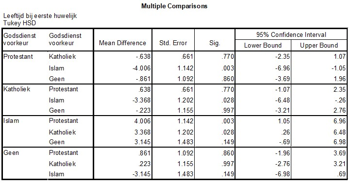

```{r, echo = FALSE, results = "hide"}
include_supplement("uu-Post-hoc-test-801-nl-tabel.jpg", recursive = TRUE)
```


Question
========
Op basis van een ANOVA-analyse wordt de conclusie getrokken dat er significante verschillen zijn tussen religieuze groepen in de leeftijd van een respondent bij zijn of haar eerste huwelijk. SPSS wordt gebruikt om een post-hoc toets te doen. De output staat hieronder.



Welke religieuze groep zorgt ervoor dat we H0 verwerpen?

Answerlist
----------
* Islam
* Katholiek
* Protestant
* Geen


Solution
========


Meta-information
================
exname: uu-Post-hoc test-801-nl
extype: schoice
exsolution: 1000
exsection: Inferential Statistics/Parametric Techniques/ANOVA/Post-hoc test
exextra[ID]: 3d790
exextra[Type]: Interpretating output
exextra[Program]: SPSS
exextra[Language]: Dutch
exextra[Level]: Statistical Literacy