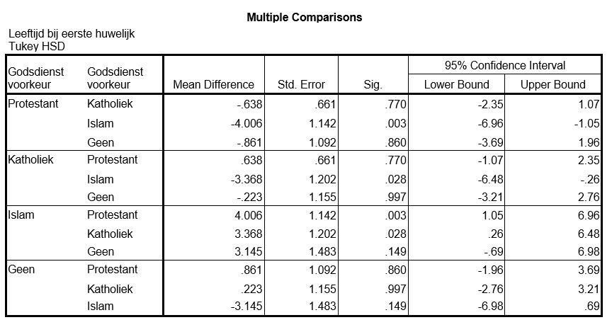

```{r, echo = FALSE, results = "hide"}
include_supplement("uu-Post-hoc-test-802-nl-graph01.jpg", recursive = TRUE)
include_supplement("uu-Post-hoc-test-802-nl-graph02.jpg", recursive = TRUE)
```
Question
========


With a p-value of 0.007, we can conclude that there are significant differences between the groups with different religion. SPSS is used to do a post hoc test. The output is shown below.



What religion causes us to $H_{0}$ reject?

Answerlist
----------
* Islam
* Catholic
* Protestant
* None


Solution
========

Meta-information
================
exname: uu-Post-hoc test-802-en
extype: schoice
exsolution: 1000
exsection: Inferential Statistics/Parametric Techniques/ANOVA/Post-hoc test
exextra[Type]: Interpretating output
exextra[Program]: SPSS
exextra[Language]: English
exextra[Level]: Statistical Reasoning