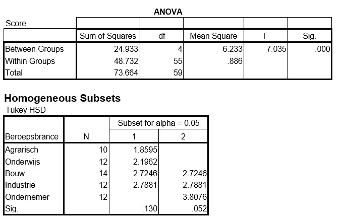

```{r, echo = FALSE, results = "hide"}
include_supplement("uu-Post-hoc-test-804-nl-graph01.jpg", recursive = TRUE)
```
Question
========
Signalen van werkstress kunnen variëren van onschuldig tot levensbedreigend. Enkele kenmerken en signalen van werkstress zijn verlies van het gevoel voor humor, concentratieverlies, ongeduldigheid, en vijandig reageren. Ongeduldigheidskenmerken van mannen met werkstress uit verschillende beroepsbranches worden vergeleken. 



De uitkomst van de toets is dat er significante verschillen zijn tussen de vijf verschillende beroepsbranches (p < .001). Er is een post-hoc toets uitgevoerd om te kijken waar de verschillen zitten. Tussen welke van de onderstaande paren van beroepsbranches is het verschil in gemiddelde ongeduldigheidsscore significant?

Answerlist
----------
* Onderwijs vs. Ondernemers
* Agrarisch vs. Industrie
* Bouw vs. Agrarisch
* Ondernemers vs. Bouw


Solution
========


Meta-information
================
exname: uu-Post-hoc test-804-nl
extype: schoice
exsolution: 1000
exsection: Inferential Statistics/Parametric Techniques/ANOVA/Post-hoc test
exextra[ID]: 90588
exextra[Type]: Interpretating output
exextra[Program]: 
exextra[Language]: Dutch
exextra[Level]: Statistical Literacy