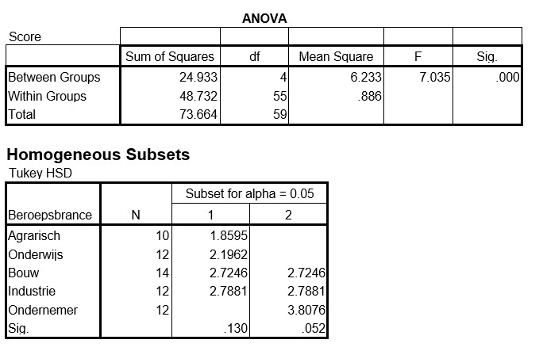

```{r, echo = FALSE, results = "hide"}
include_supplement("uu-Post-hoc-test-805-nl-graph01.jpg", recursive = TRUE)
```
Question
========
Signalen van werkstress kunnen variëren van onschuldig tot levensbedreigend. Enkele kenmerken en signalen van werkstress zijn verlies van het gevoel voor humor, concentratieverlies, ongeduldigheid, en vijandig reageren. Ongeduldigheidskenmerken van mannen met werkstress uit verschillende beroepsbranches worden vergeleken. 



Wat is de waarde van de effectgrootte die bij deze analyse gerapporteerd moet worden?

Answerlist
----------
* 7.035
* 0.338
* 0.512
* 0.886


Solution
========


Meta-information
================
exname: uu-Post-hoc test-805-nl
extype: schoice
exsolution: 0100
exsection: Inferential Statistics/Parametric Techniques/ANOVA/Post-hoc test
exextra[ID]: c4e2e
exextra[Type]: Interpretating output
exextra[Program]: SPSS
exextra[Language]: Dutch
exextra[Level]: Statistical Literacy