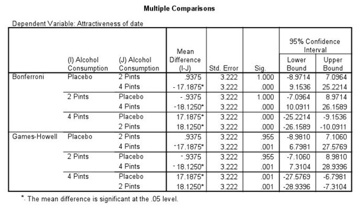

```{r, echo = FALSE, results = "hide"}
include_supplement("uu-Post-hoc-test-806-nl-graph01.jpg", recursive = TRUE)
```
Question
========
De onderzoeksvraag is of het drinken van alcohol tijdens een avond stappen invloed heeft  op de beoordeling van de fysieke aantrekkelijkheid van potentiële partners. De hypothese  is dat het drinken van alcohol de perceptie van aantrekkelijkheid van een potentiële  partner verstoort. In het onderzoek worden drie groepen, die verschillen in  alcoholconsumptie (ALCOHOL CONSUMPTION), onderscheiden:

1. placebo (kregen geen alcohol te drinken), 
2. twee glazen (pints) alcohol,
3. vier glazen (pints) alcohol.

De deelnemers aan het onderzoek moesten dezelfde persoon beoordelen op fysieke aantrekkelijkheid (ATTRACTIVENESS OF DATE, gemeten op een schaal van 1 = zeer onaantrekkelijk tot 100 = zeer aantrekkelijk). 

In een ANOVA op de verzamelde gegevens bleek dat de drie groepen significant van elkaar verschilden in de gemiddelde beoordeling van ATTRACTIVENESS OF DATE. Aansluitend is een post-hoc toetsing uitgevoerd.



Welke conclusie is correct als je je baseert op de SPSS uitvoer?

Answerlist
----------
* De drie groepen verschillen onderling paarsgewijs significant in de beoordeling van de aantrekkelijkheid van de potentiële partner.
* De groep die twee glazen alcohol dronk, vindt de potentiële partner het aantrekkelijkst.
* De groep die geen alcohol dronk, vindt de potentiële partner minder aantrekkelijk dan de groep die twee glazen alcohol dronk.
* De groep die vier glazen alcohol dronk, vindt de potentiële partner aantrekkelijker dan de groepen die twee of geen glazen alcohol dronken


Solution
========


Meta-information
================
exname: uu-Post-hoc test-806-nl
extype: schoice
exsolution: 0001
exsection: Inferential Statistics/Parametric Techniques/ANOVA/Post-hoc test
exextra[ID]: c979a
exextra[Type]: Interpretating output
exextra[Program]: 
exextra[Language]: Dutch
exextra[Level]: Statistical Reasoning