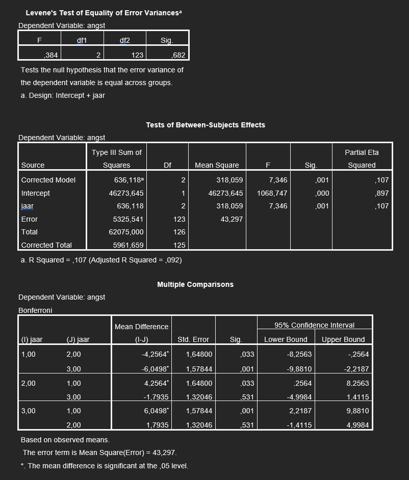

```{r, echo = FALSE, results = "hide"}
include_supplement("uu-Post-hoc-test-807-nl-graph01.jpg", recursive = TRUE)
```
Question
========
A statistics teacher wants to compare the statistics anxiety of 1st-, 2nd- and 3rd-year psychology students. The instructor's outputs include the following:



What conclusion can the statistics teacher draw?

Answerlist
----------
* 1st-year psychology students have significantly more statistics anxiety than 2nd- and 3rd-year psychology students
* There is a positive relationship between number of years studying and statistics anxiety.
* There is a negative relationship between number of years studying and statistics anxiety.
* 1st-year psychology students have significantly less statistics anxiety than 2nd- and 3rd-year psychology students


Solution
========
The Multiple comparisons table shows that 1st-year students are significantly different from 2nd-year students (p = .033 < $\alpha$ = .05), and of 3rd-year students (p = .001 < $\alpha $ = .05) in statistics anxiety. In the Mean difference column, we can read whether the difference is positive or negative. This is calculated by column I-J. The difference is negative; thus, 2nd- and 3rd-year students show more statistics anxiety than 1st-year students.

Meta-information
================
exname: uu-Post-hoc test-807-en
extype: schoice
exsolution: 0001
exsection: Inferential Statistics/Parametric Techniques/ANOVA/Post-hoc test
exextra[ID]: 804b4
exextra[Type]: Case
exextra[Program]: SPSS
exextra[Language]: English
exextra[Level]: Statistical Reasoning