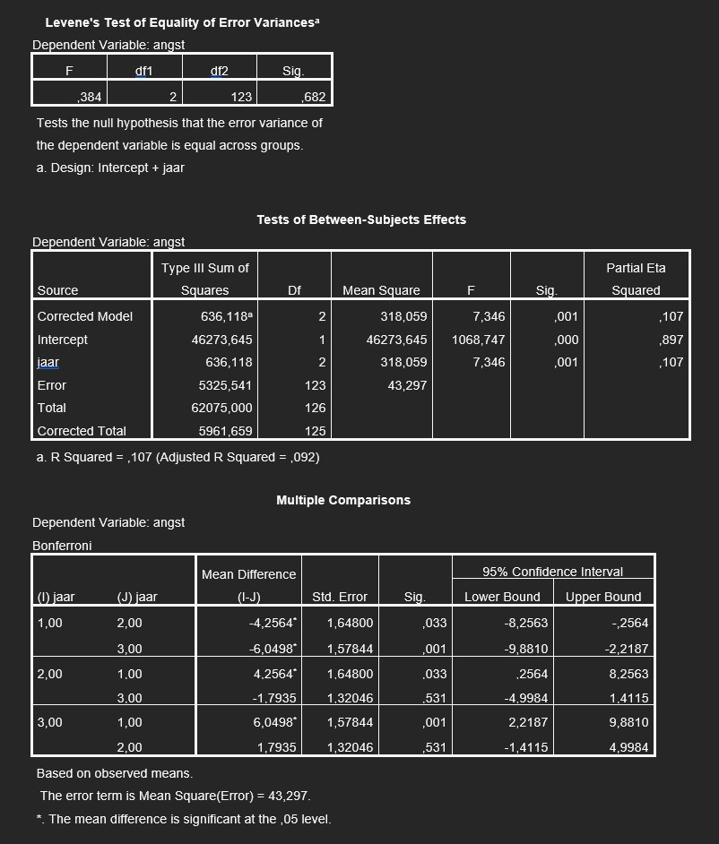

```{r, echo = FALSE, results = "hide"}
include_supplement("uu-Post-hoc-test-807-nl-graph01.jpg", recursive = TRUE)
```
Question
========
Een statistiek docent wil de statistiek-angst van 1e-, 2e- en 3e-jaars psychologiestudenten vergelijken. De docent krijgt onder andere de volgende output:



Welke conclusie kan de statistiek docent trekken?

Answerlist
----------
* 1e-jaars psychologiestudenten hebben significant meer statistiekangst dan 2e- en 3e-jaars psychologiestudenten
* Er is een positieve relatie tussen aantal jaar studeren en statistiek-angst.
* Er is een negatieve relatie tussen aantal jaar studenten en statistiek-angst.
* 1e-jaars psychologiestudenten hebben significant minder statistiekangst dan 2e- en 3e-jaars psychologiestudenten


Solution
========
In de tabel ‘Multiple comparisons’ valt af te lezen dat 1e-jaars studenten significant verschillen van 2e-jaars studenten (p = .033 < $\alpha$ = .05), en van 3e-jaars studenten (p = .001 < $\alpha $ = .05) in statistiekangst. In de kolom ‘Mean difference’ kunnen we aflezen of het verschil positief of negatief is. Dat wordt berekend door kolom I-J. Het verschil is negatief; 2e- en 3e-jaars studenten tonen dus meer statistiekangst dan 1e-jaars studenten.


Meta-information
================
exname: uu-Post-hoc test-807-nl
extype: schoice
exsolution: 0001
exsection: Inferential Statistics/Parametric Techniques/ANOVA/Post-hoc test
exextra[Type]: Case
exextra[Program]: SPSS
exextra[Language]: Dutch
exextra[Level]: Statistical Reasoning