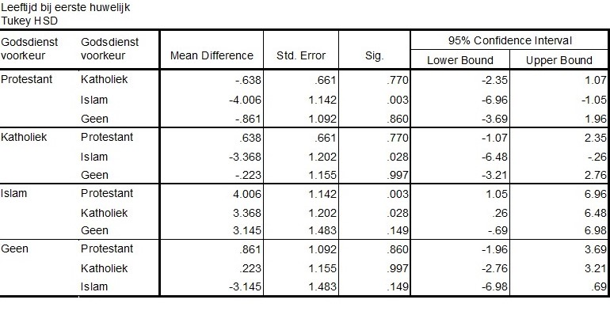

```{r, echo = FALSE, results = "hide"}
include_supplement("uu-Post-hoc-test-810-nl-graph01.jpg", recursive = TRUE)
```
Question
========
An ANOVA was used to conclude that religious preference groups differ significantly from each other in age of first marriage. Post-hoc testing was used to examine which religious preference groups differ from each other. The output is shown below.



Which preference group makes us $H_0$ reject?

Answerlist
----------
* Catholic
* Protestant
* No
* Islam


Solution
========
The groups that differ significantly from each other are Islam-Protestant and Islam-Catholic. The other groups do not differ from each other. Thus, the preference group Islam provides us with $H_{0}$ reject.

Meta-information
================
exname: uu-Post-hoc test-810-en
extype: schoice
exsolution: 0001
exsection: Inferential Statistics/Parametric Techniques/ANOVA/Post-hoc test
exextra[ID]: 8ddec
exextra[Type]: Interpretating output
exextra[Program]: SPSS
exextra[Language]: English
exextra[Level]: Statistical Reasoning