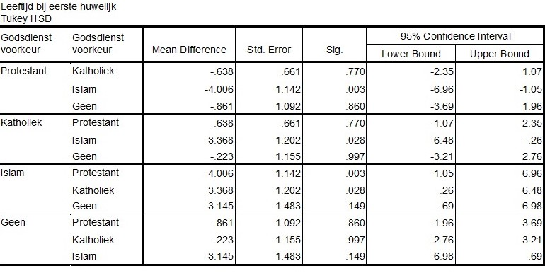

```{r, echo = FALSE, results = "hide"}
include_supplement("uu-Post-hoc-test-810-nl-graph01.jpg", recursive = TRUE)
```
Question
========
Met behulp van een ANOVA is geconcludeerd dat godsdienstelijke voorkeursgroepen significant van elkaar verschillen in de leeftijd van een eerste huwelijk. Met behulp van post-hoc toetsing is gekeken welke godsdienstelijke voorkeursgroepen van elkaar verschillen. De output staat hieronder.



Welke voorkeursgroep zorgt ervoor dat we $H_0$ verwerpen?

Answerlist
----------
* Katholiek
* Protestant
* Geen
* Islam


Solution
========
De groepen die significant van elkaar verschillen zijn Islam-Protestant en Islam-Katholiek. De andere groepen verschillen niet van elkaar. De voorkeursgroep Islam zorgt er dus voor dat we $H_{0}$ verwerpen.


Meta-information
================
exname: uu-Post-hoc test-810-nl
extype: schoice
exsolution: 0001
exsection: Inferential Statistics/Parametric Techniques/ANOVA/Post-hoc test
exextra[ID]: fb220
exextra[Type]: Interpretating output
exextra[Program]: SPSS
exextra[Language]: Dutch
exextra[Level]: Statistical Reasoning