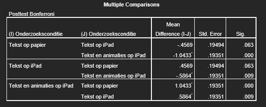

```{r, echo = FALSE, results = "hide"}
include_supplement("uu-Post-hoc-test-811-nl-graph01.jpg", recursive = TRUE)
```
Question
========
In een onderzoek naar begrijpend lezen worden drie onderzoekscondities met elkaar vergeleken: 1) “tekst op papier”, 2) “tekst op iPad” en 3) “tekst en animaties op iPad”. Na afloop van het lezen van de tekst, maken de leerlingen een toets waarmee vastgesteld wordt hoe goed zij de tekst begrepen hebben. De onderzoekers hebben met een eenweg ANOVA vastgesteld dat de gemiddelde scores op de toets verschillen voor de drie onderzoekscondities, F(2, 97) = 14.63, p < .001, $\eta^2$ = .23. 

Welke conclusie is gerechtvaardigd op basis van de onderstaande output?



Answerlist
----------
* Leerlingen in de conditie “Tekst op iPad” scoren significant hoger op de toets dan leerlingen in de conditie “Tekst en animaties op iPad”.
* Leerlingen in de conditie “Tekst op iPad” scoren significant lager op de toets dan leerlingen in de andere twee condities.
* Leerlingen in de condities “Tekst op iPad” en “Tekst en animaties op iPad” scoren allebei significant hoger op de toets dan leerlingen in de conditie “Tekst op papier”.
* Leerlingen in de conditie “Tekst en animaties op iPad” scoren significant hoger op de toets dan leerlingen in de andere twee condities.


Solution
========


Meta-information
================
exname: uu-Post-hoc test-811-nl
extype: schoice
exsolution: 0001
exsection: Inferential Statistics/Parametric Techniques/ANOVA/Post-hoc test
exextra[Type]: Interpretating output
exextra[Program]: SPSS
exextra[Language]: Dutch
exextra[Level]: Statistical Reasoning