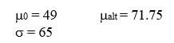

```{r, echo = FALSE, results = "hide"}
include_supplement("uu-Power-801-nl-tabel.jpg", recursive = TRUE)
```

Question
========
  
What is the smallest sample size at which researchers achieve a power of at least 83% at $\alpha = .05$ and two-sided testing? 


  
Answerlist
----------
* 8
* 55
* 69
* 73

Solution
========
  


Answerlist
----------
* This is unfortunately false.
* This is unfortunately wrong.
* Nice!
* This is unfortunately wrong.

Meta-information
================
exname: uu-Power-801-en
extype: string
exsolution: 0010
exsection: Inferential Statistics/NHST/Power
exextra[Type]: Conceptual
exextra[Language]: English
exextra[Level]: Statistical Literacy
