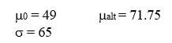

```{r, echo = FALSE, results = "hide"}
include_supplement("uu-Power-801-nl-tabel.jpg", recursive = TRUE)
```


Question
========
  
Wat is de kleinste steekproefomvang waarbij de onderzoekers een power bereiken van tenminste 83% bij $\alpha = .05$ en tweezijdig toetsen? 


  
Answerlist
----------
* 8
* 55
* 69
* 73

Solution
========
  


Answerlist
----------
* Dit is helaas fout.
* Dit is helaas fout.
* Nice!
* Dit is helaas fout.


Meta-information
================
exname: uu-Power-801-nl.Rmd
extype: string
exsolution: 0010
exsection: Inferential Statistics/NHST/Power
exextra[Type]: Conceptual
exextra[Language]: Dutch
exextra[Level]: Statistical Literacy
