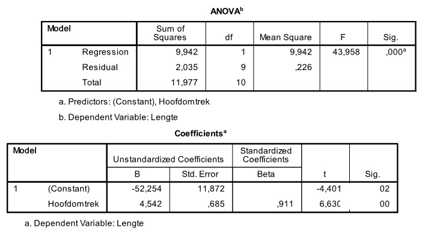

```{r, echo = FALSE, results = "hide"}
include_supplement("uu-R-squared-601-nl-tabel.jpg", recursive = TRUE)
```

Question
========
  
A pediatrician would like to describe the relationship that may exist between children's height and head circumference. She is collecting data from some 3-year-old patients from her practice. Part of the SPSS output is below.



One of the ways we can measure the quality of a regression model is by the percentage of variance explained. What is the value of the percentage of variance explained for the regression model above? 
Answerlist
----------
* 83.0%
* 9.94%
* 43.96%
* 91.1% 


Solution
========

Meta-information
================
exname: uu-R-squared-601-en
extype: schoice
exsolution: 1000
exsection: Inferential Statistics/Regression/R squared
exextra[ID]: 79873
exextra[Type]: Interpretating output, calculation
exextra[Program]: SPSS
exextra[Language]: English
exextra[Level]: Statistical Literacy
