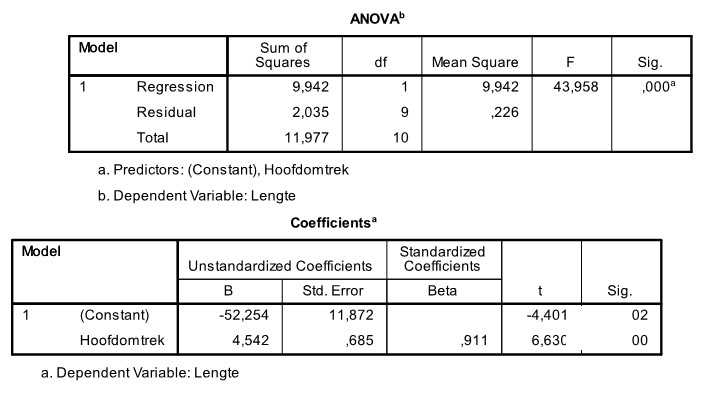

```{r, echo = FALSE, results = "hide"}
include_supplement("uu-R-squared-601-nl-tabel.jpg", recursive = TRUE)
```

Question
========
  
Een kinderarts wil graag de relatie beschrijven die eventueel bestaat tussen de lengte van kinderen en hun hoofdomtrek. Ze verzamelt data van enkele 3-jarige patiënten van haar praktijk. Een deel van de SPSS-output staat hieronder.



Een van de manieren waarop we de kwaliteit van een regressiemodel kunnen meten is a.d.h.v. het percentage verklaarde variantie. Wat is de waarde van het percentage verklaarde variantie voor bovenstaand regressiemodel?
  
Answerlist
----------
* 83.0% 
* 9.94% 
* 43.96% 
* 91.1% 


Solution
========
  


Meta-information
================
exname: uu-R-squared-601-nl.Rmd
extype: schoice
exsolution: 1000
exsection: Inferential Statistics/Regression/R squared
exextra[Type]: Interpretating output, calculation
exextra[Program]: SPSS
exextra[Language]: Dutch
exextra[Level]: Statistical Literacy
