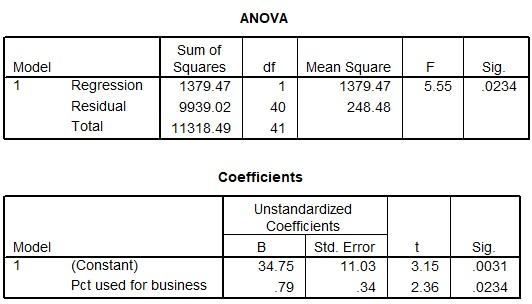

```{r, echo = FALSE, results = "hide"}
include_supplement("uu-R-squared-602-nl-tabel.jpg", recursive = TRUE)
```

Question
========
  
A telephone company is researching the relationship between the average monthly phone bill cost (Y = Average monthly bill) and the percentage of call minutes used for business (X = Pct used for business). SPSS output is below. 



What percentage of the total spread in average monthly costs is explained by the linear relationship with the percentage of call minutes used for work? 
Answerlist
----------
* 5.55%
* 12.2%
* 34.75%
* 87.8%
 


Solution
========

Meta-information
================
exname: uu-R-squared-602-en
extype: schoice
exsolution: 0100
exsection: Inferential Statistics/Regression/R squared
exextra[Type]: Interpretating output, calculation
exextra[Program]: SPSS
exextra[Language]: English
exextra[Level]: Statistical Literacy
