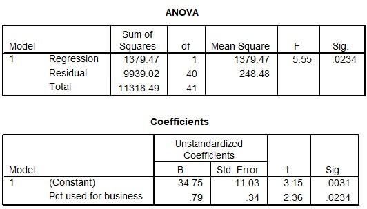

```{r, echo = FALSE, results = "hide"}
include_supplement("uu-R-squared-602-nl-tabel.jpg", recursive = TRUE)
```


Question
========
  
Een telefoonmaatschappij doet onderzoek naar het verband tussen de gemiddelde maandelijkse kosten van de telefoonrekening (Y = Average monthly bill) en het percentage van de belminuten dat gebruikt wordt voor het werk (X = Pct used for business). SPSS-output staat hieronder. 



Welk percentage van de totale spreiding in gemiddelde maandelijkse kosten wordt verklaard door het lineaire verband met het percentage belminuten dat gebruikt wordt voor het werk?
  
Answerlist
----------
* 5.55%
* 12.2% 
* 34.75%
* 87.8%
 


Solution
========
  


Meta-information
================
exname: uu-R-squared-602-nl.Rmd
extype: schoice
exsolution: 0100
exsection: Inferential Statistics/Regression/R squared
exextra[Type]: Interpretating output, calculation
exextra[Program]: SPSS
exextra[Language]: Dutch
exextra[Level]: Statistical Literacy
