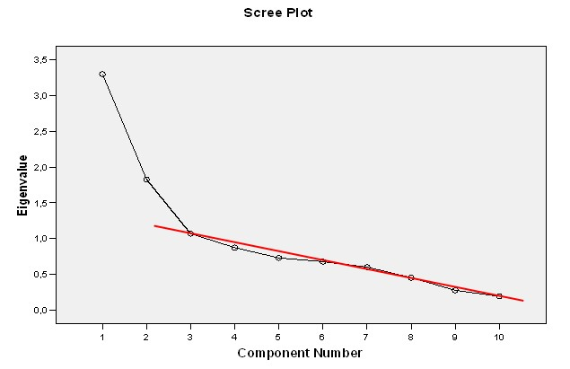

```{r, echo = FALSE, results = "hide"}
include_supplement("uu-Scree-plot-007-nl-tabel.jpg", recursive = TRUE)
```

```{r, echo = FALSE, results = "hide"}
include_supplement("uu-Scree-plot-007-nl-tabel2.jpg", recursive = TRUE)
```


Question
========
Hieronder de scree-plot van een hoofdcomponentenanalyse voor een schaal van tien items over eetproblemen.


Hoeveel factoren zou je kiezen op basis van de scree-plot?  

Answerlist
----------
* 1 factor
* 2 factoren
* 3 factoren
* 4 factoren

Solution
========
  
We gebruiken de scree-plot om te zoeken naar de overgang tussen het eerste aantal factoren welke veel variantie verklaren en de factoren die daarna komen die alle ongeveer evenveel variantie verklaren. Vervolgens kiezen we het aantal factoren dat in de figuur voor/boven de eerste knik ligt. 

In deze figuur kiezen we op basis van het knik-criterium 2 factoren (zie de extra getrokken lijn in de figuur).




Answerlist
----------


Meta-information
================
exname: uu-Scree-plot-007-nl.rmd
extype: schoice
exsolution: 0100
exsection: Factor analysis/Scree plot
exextra[Type]: Interpreting graph
exextra[Program]: SPSS
exextra[Language]: Dutch
exextra[Level]: Statistical Literacy

