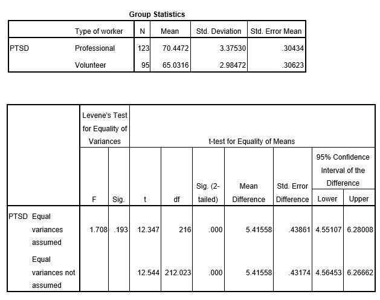

```{r, echo = FALSE, results = "hide"}
include_supplement("uu-Standard-Deviation-800-en-tabel.jpg", recursive = TRUE)
```


Question
========
  
A team of researchers is interested in post-traumatic stress symptoms experienced by rescue workers after a major earth quake. They want to investigate if volunteer rescue workers experience higher levels of PTSD than members of professional rescue squads. Three weeks after the earthquake, 95 volunteers and 123 professional rescue workers completed a questionnaire in which PTSD symptoms were measured on a scale from 0 to 100.

They find the following results:




In this example, what is the standard deviation of the comparison distribution?
  
Answerlist
----------
* 0.439
* 3.375
* 0.432
* 2.984


Solution
========
  


Meta-information
================
exname: uu-Standard-Deviation-800-en.Rmd
extype: schoice
exsolution: 1000
exsection: Descriptive statistics/Summary Statistics/Measures of Spread/Standard Deviation, Inferential Statistics/Parametric Techniques/t-test/Independent samples means
exextra[Type]: Interpretating output
exextra[Program]: SPSS
exextra[Language]: English
exextra[Level]: Statistical Literacy
