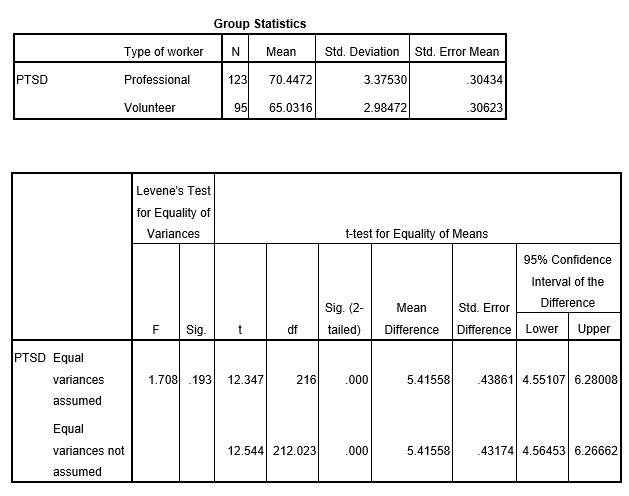

```{r, echo = FALSE, results = "hide"}
include_supplement("uu-Standard-Deviation-800-en-tabel.jpg", recursive = TRUE)
```

Question
========
  
Een team onderzoekers is geïnteresseerd in posttraumatische stresssymptomen die reddingswerkers ervaren na een zware aardbeving. Ze willen onderzoeken of vrijwillige reddingswerkers hogere niveaus van PTSS ervaren dan leden van professionele reddingsploegen. Drie weken na de aardbeving vulden 95 vrijwilligers en 123 professionele reddingswerkers een vragenlijst in waarin PTSS-symptomen werden gemeten op een schaal van 0 tot 100.

Ze vonden de volgende resultaten:




Wat is in dit voorbeeld de standaardafwijking van de vergelijkingsverdeling? 
Answerlist
----------
* 0.439
* 3.375
* 0.432
* 2.984


Solution
========

Meta-information
================
exname: uu-Standard-Deviation-800-nl
extype: schoice
exsolution: 1000
exsection: Descriptive statistics/Summary Statistics/Measures of Spread/Standard Deviation, Inferential Statistics/Parametric Techniques/t-test/Independent samples means
exextra[Type]: Interpretating output
exextra[Program]: SPSS
exextra[Language]: Dutch
exextra[Level]: Statistical Literacy
