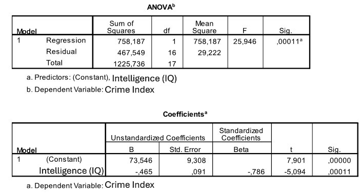

```{r, echo = FALSE, results = "hide"}
include_supplement("uu-Standard-error-of-the-estimate-801-nl-tabel.JPG", recursive = TRUE)
```


Question
========
  
A psychologist attached to a prison is interested in the relationship between crime and intelligence. A crime index (between 0 and 50) is formulated that takes into account the severity and frequency of crimes committed. Intelligence is measured with a standardized IQ test. Eighteen convicted juveniles participate in this study. SPSS was used to describe the relationship between the two variables. Part of the SPSS output is shown below.



What is the value of the regression coefficient standard error (invisible in the table) for IQ? 
Answerlist
----------
* 0.091
* 0.592
* 2.369
* 10.96


Solution
========

Answerlist
----------
* This answer is correct.
* This answer is incorrect.
* This answer is incorrect.
* This answer is incorrect.

Meta-information
================
exname: uu-Standard-error-of-the-estimate-801-en
extype: schoice
exsolution: 1000
exsection: Inferential Statistics/Regression/Standard error of the estimate
exextra[Type]: Interpretating output
exextra[Program]: SPSS
exextra[Language]: English
exextra[Level]: Statistical Literacy