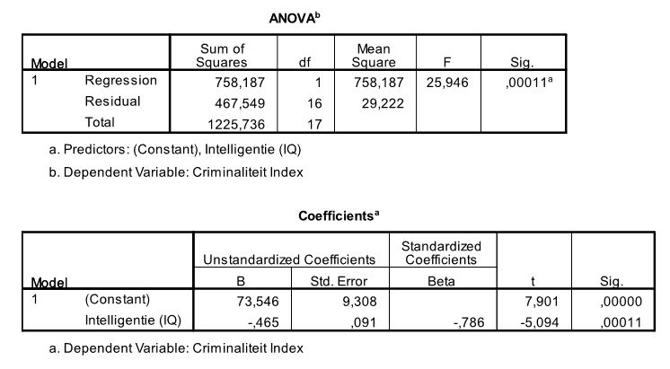

```{r, echo = FALSE, results = "hide"}
include_supplement("uu-Standard-error-of-the-estimate-801-nl-tabel.JPG", recursive = TRUE)
```


Question
========
  
Een psycholoog verbonden aan een gevangenis is geïnteresseerd in de relatie tussen criminaliteit en intelligentie. Een criminaliteitsindex (tussen 0 en 50) wordt geformuleerd die rekening houdt met de zwaarte en de frequentie van de gepleegde misdrijven. Intelligentie wordt gemeten met een gestandaardiseerde IQ test. Achttien veroordeelde jongeren doen mee met dit onderzoek. SPSS is gebruikt om de relatie tussen de twee variabelen te beschrijven. Een deel van de SPSS-output is hieronder te zien.



Welke waarde heeft de (in de tabel onzichtbaar gemaakte) standaardfout van de regressiecoëfficiënt voor IQ? 
  
Answerlist
----------
* 0.091  
* 0.592
* 2.369
* 10.96


Solution
========

Answerlist
----------
* Dit antwoord is correct.
* Dit antwoord is incorrect.
* Dit antwoord is incorrect.
* Dit antwoord is incorrect.

Meta-information
================
exname: uu-Standard-error-of-the-estimate-801-nl.Rmd
extype: schoice
exsolution: 1000
exsection: Inferential Statistics/Regression/Standard error of the estimate
exextra[Type]: Interpretating output
exextra[Program]: SPSS
exextra[Language]: Dutch
exextra[Level]: Statistical Literacy