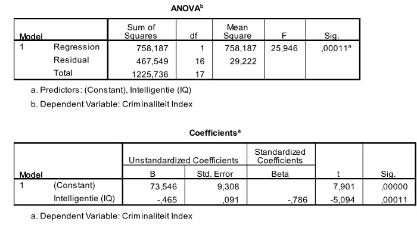

```{r, echo = FALSE, results = "hide"}
include_supplement("uu-Standard-error-of-the-estimate-802-nl-tabel.jpg", recursive = TRUE)
```

Question
========
  
The standard error of estimate is a measure of the dispersion around the regression line. With much dispersion around the regression line, the predictions we make with the model are much less accurate than with little dispersion. What is the value of the standard error of estimate for the model?


  
Answerlist
----------
* 467.549
* 29.222
* 27.54
* 5.406


Solution
========

Meta-information
================
exname: uu-Standard-error-of-the-estimate-802-en
extype: schoice
exsolution: 0001
exsection: Inferential Statistics/Regression/Standard error of the estimate
exextra[Type]: Interpretating output
exextra[Program]: SPSS
exextra[Language]: English
exextra[Level]: Statistical Literacy
