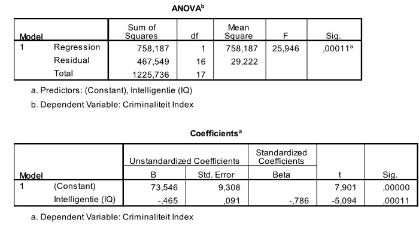

```{r, echo = FALSE, results = "hide"}
include_supplement("uu-Standard-error-of-the-estimate-802-nl-tabel.jpg", recursive = TRUE)
```


Question
========
  
De standaardschattingsfout is een maat om de spreiding rond de regressielijn te meten. Bij veel spreiding rond de regressielijn zijn de voorspellingen die we doen met het model veel minder nauwkeurig dan bij weinig spreiding. Wat is de waarde van de standaardschattingsfout voor het model?


  
Answerlist
----------
* 467.549
* 29.222
* 27.54
* 5.406


Solution
========
  


Answerlist
----------


Meta-information
================
exname: uu-Standard-error-of-the-estimate-802-nl.Rmd
extype: schoice
exsolution: 0001
exsection: Inferential Statistics/Regression/Standard error of the estimate
exextra[Type]: Interpretating output
exextra[Program]: SPSS
exextra[Language]: Dutch
exextra[Level]: Statistical Literacy
