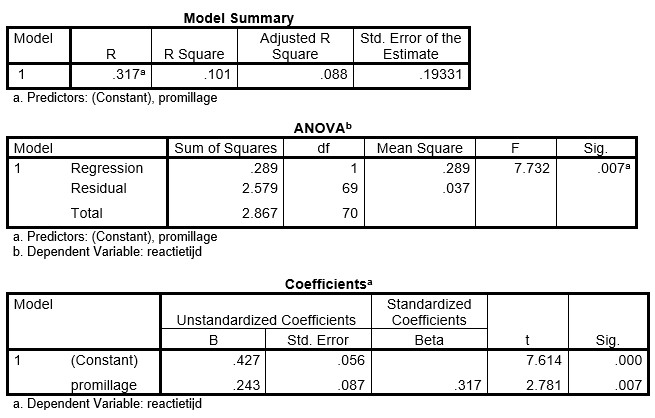

```{r, echo = FALSE, results = "hide"}
include_supplement("uu-Standard-error-of-the-estimate-803-nl-tabel.jpg", recursive = TRUE)
```

Question
========
  
A study examines whether there is a relationship between blood alcohol level and reaction time of young adults. The researcher performs a regression analysis on the collected data. The result is shown in the tables below.



What does the Standard Error of the Estimate in the Model summary table mean? 
Answerlist
----------
* This is the standard error of the slope coefficient
* This is the standard error of the intercept
* This is the standard deviation of the distances between the data points and the regression line
* This is the standard deviation of the predictions we can make with this model


Solution
========

Meta-information
================
exname: uu-Standard-error-of-the-estimate-803-en
extype: schoice
exsolution: 0010
exsection: Inferential Statistics/Regression/Standard error of the estimate
exextra[ID]: 4a751
exextra[Type]: Interpretating output
exextra[Program]: SPSS
exextra[Language]: English
exextra[Level]: Statistical Literacy
