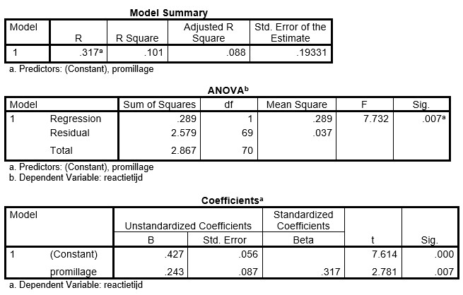

```{r, echo = FALSE, results = "hide"}
include_supplement("uu-Standard-error-of-the-estimate-803-nl-tabel.jpg", recursive = TRUE)
```


Question
========
  
In een onderzoek wordt nagegaan of er een relatie is tussen het alcoholpromillage in het bloed en de reactietijd van jongvolwassenen. De onderzoeker voert op de verzamelde data een regressieanalyse uit. Het resultaat staat in de onderstaande tabellen.



Wat betekent de Standard Error of the Estimate in de Model summary-tabel?
  
Answerlist
----------
* Dit is de standaardafwijking van de richtingscoëfficiënt
* Dit is de standaardafwijking van het intercept
* Dit is de standaardafwijking van de afstanden tussen de datapunten en de regressielijn 
* Dit is de standaardafwijking van de voorspellingen die we met dit model kunnen maken


Solution
========
  


Meta-information
================
exname: uu-Standard-error-of-the-estimate-803-nl.Rmd
extype: schoice
exsolution: 0010
exsection: Inferential Statistics/Regression/Standard error of the estimate
exextra[Type]: Interpretating output
exextra[Program]: SPSS
exextra[Language]: Dutch
exextra[Level]: Statistical Literacy
