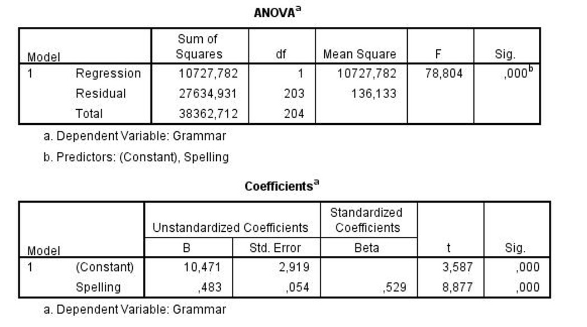

```{r, echo = FALSE, results = "hide"}
include_supplement("uu-Standard-error-of-the-estimate-804-nl-graph01.jpg", recursive = TRUE)
```
Question
========
A survey of British elementary school collects data on a variety of variables related to children's intelligence and achievement. Variables include reading, spelling, general knowledge, vocabulary, etc. The analysis below looks at whether, for children in grade 7, grammar (grammar) scores can be predicted using spelling scores. 



The standard error of estimate is a measure of the dispersion around the regression line. What is the value of the standard error of estimate for this model?

Answerlist
----------
* 2.9
* 11.7
* 103.6
* 166.2


Solution
========

Meta-information
================
exname: uu-Standard-error-of-the-estimate-804-en
extype: schoice
exsolution: 0100
exsection: Inferential Statistics/Regression/Standard error of the estimate
exextra[ID]: a8d08
exextra[Type]: Interpretating output, Calculation
exextra[Program]: 
exextra[Language]: English
exextra[Level]: Statistical Reasoning