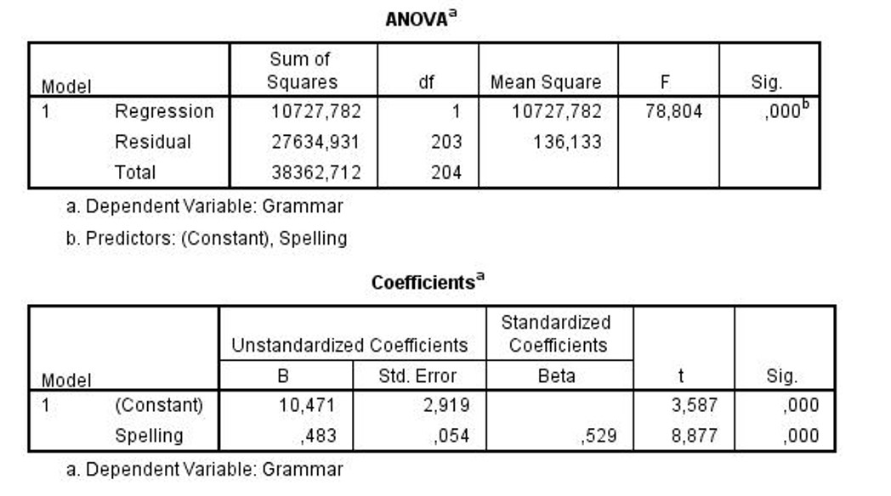

```{r, echo = FALSE, results = "hide"}
include_supplement("uu-Standard-error-of-the-estimate-804-nl-graph01.jpg", recursive = TRUE)
```
Question
========
Bij een onderzoek onder Britse basisscholen wordt er data verzameld over allerlei variabelen die te maken hebben met de intelligentie en prestatie van de kinderen. Variabelen zoals lezen, spelling, algemene kennis, woordenschat, enz. In onderstaande analyse wordt gekeken of voor kinderen in groep 7 de score op grammar (grammatica) voorspeld kan worden met behulp van de scores op spelling. 



De standaardschattingsfout is een maat om de spreiding rond de regressielijn te meten. Wat is de waarde van de standaardschattingsfout voor dit model?

Answerlist
----------
* 2.9
* 11.7
* 103.6
* 166.2


Solution
========


Meta-information
================
exname: uu-Standard-error-of-the-estimate-804-nl
extype: schoice
exsolution: 0100
exsection: Inferential Statistics/Regression/Standard error of the estimate
exextra[ID]: 4f788
exextra[Type]: Interpretating output, Calculation
exextra[Program]: 
exextra[Language]: Dutch
exextra[Level]: Statistical Reasoning