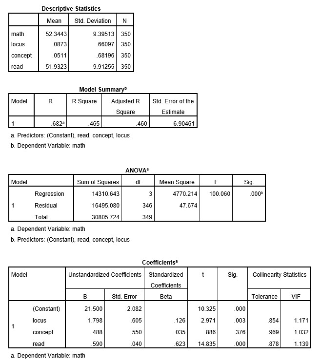

```{r, echo = FALSE, results = "hide"}
include_supplement("uu-Standardized-coefficient-800-en-tabel.jpg", recursive = TRUE)
```


Question
========
  
You see SPSS output from a multiple regression model from a dataset from the US National Center of Educational Statistics. This dataset is called High School Beyond and has data on variables related to students’ academic achievement. Specifically, the outcome variable for the regression model is “Math Score” which is predicted from “Locus of Control”, “Self-Concept”, and “Reading Score”. In addition, the Appendix includes plots that were created from the same model. Use the plots to help you answer questions about assumptions of the regression model for the High School Beyond dataset. 
Provide a one sentence interpretation for the standardized regression coefficient of the predictor “Reading Score”. 




  
Answerlist
----------


Solution
========
  
The effect of reading score on math score when standardized, providing the effect size of the predictor and thus enabling comparison between predictors. With value of 0.62 it has the highest standardized regression coefficient of all predictors, and thus largest effect on math score. 

Comparison with other predictors (1 pt)

Beta = 0.62 (1 pt)

IF ONLY Standardized / effect size explanation (1 pt)


Answerlist
----------


Meta-information
================
exname: uu-Standardized-coefficient-800-en.Rmd
extype: string
exsolution: Beta = 0.62
exsection: Inferential Statistics/Regression/Standardized coefficient
exextra[Type]: Interpretating output
exextra[Program]: SPSS
exextra[Language]: English
exextra[Level]: Statistical Literacy
