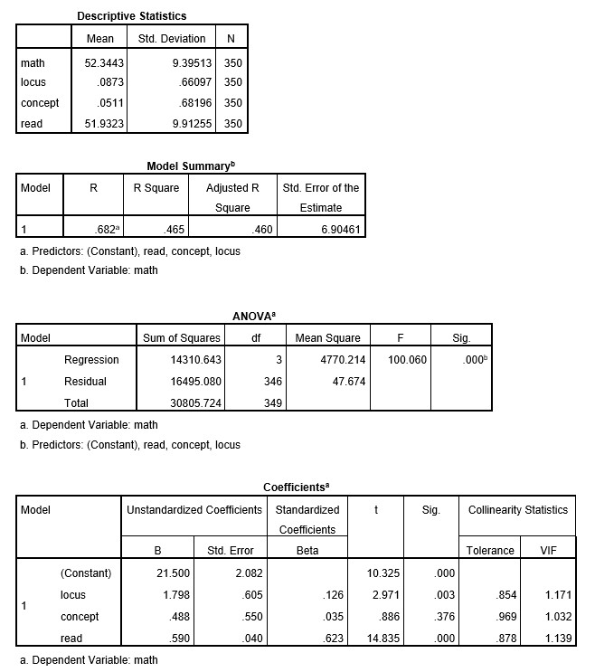

```{r, echo = FALSE, results = "hide"}
include_supplement("uu-Standardized-coefficient-800-en-tabel.jpg", recursive = TRUE)
```


Question
========
  
Je ziet SPSS-uitvoer van een meervoudig regressiemodel van een dataset van het Amerikaanse National Center of Educational Statistics. Deze dataset heet High School Beyond en bevat gegevens over variabelen met betrekking tot de academische prestaties van leerlingen. Specifiek is de uitkomstvariabele voor het regressiemodel "Wiskunde Score" die wordt voorspeld op basis van "Locus of Control", "Zelfbeeld" en "Leesscore". Daarnaast bevat de bijlage grafieken die zijn gemaakt op basis van hetzelfde model. Gebruik de grafieken om vragen te beantwoorden over assumpties van het regressiemodel voor de High School Beyond dataset. Geef een één zin interpretatie voor de gestandaardiseerde regressiecoëfficiënt van de voorspeller "Leesscore". 




  
Answerlist
----------


Solution
========
  
The effect of reading score on math score when standardized, providing the effect size of the predictor and thus enabling comparison between predictors. With value of 0.62 it has the highest standardized regression coefficient of all predictors, and thus largest effect on math score. 

Comparison with other predictors (1 pt)

Beta = 0.62 (1 pt)

IF ONLY Standardized / effect size explanation (1 pt)


Answerlist
----------

Meta-information
================
exname: uu-Standardized-coefficient-800-nl
extype: string
exsolution: Bèta = 0,62
exsection: Inferential Statistics/Regression/Standardized coefficient
exextra[Type]: Interpretating output
exextra[Program]: SPSS
exextra[Language]: Dutch
exextra[Level]: Statistical Literacy
