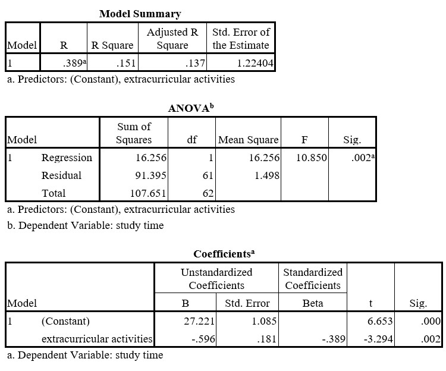

```{r, echo = FALSE, results = "hide"}
include_supplement("uu-Standardized-coefficient-801-en-tabel.jpg", recursive = TRUE)
```


Question
========
  
Some teachers would like to know if there is a relationship between the time students spend on organized extracurricular activities and the time they spend studying. Fifty students were asked to monitor for several weeks how much time they spent on extracurricular activities and on studying. The average number of hours per week was calculated for both. SPSS was used to analyze the data. 



What is the value of the correlation coefficient between time spent on extracurricular activities and time spent studying?
  
Answerlist
----------


Solution
========
  

$r=-.389$


Meta-information
================
exname: uu-Standardized-coefficient-801-en.Rmd
extype: string
exsolution: -.389
exsection: Inferential Statistics/Regression/Standardized coefficient
exextra[ID]: c6abf
exextra[Type]: Interpretating output
exextra[Program]: SPSS
exextra[Language]: English
exextra[Level]: Statistical Literacy
